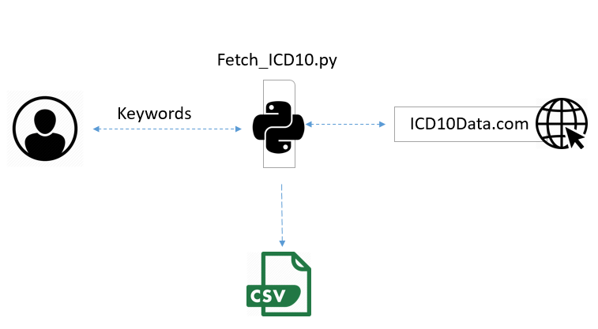

# ICD10

**Definition  **
This program fetches ICD10 codes from https://www.icd10data.com/ based on keywords. Keywords is being set by user. 
The program checks all pages of icd10data.com and returns a dataset of ICD10 codes related to keywords.  
 
**Requirements  **
**Version  **
Python 3.5 and above is needed. If you don’t have admin access, it is better to create a new environment and then install necessary libraries over it. 
See the commands below for anaconda.  
Create a new environment named py35, 
install Python 3.5	conda create --name py35 python=3.5 --> Activate the new environment to use it	activate py35  
Activate the new environment to use it --> activate py35  
 
**Libraries **
-->conda install -c anaconda lxml  
-->conda install -c anaconda requests 
-->conda install -c anaconda pandas  
 
**How to run  **
1-	Open Anaconda Prompt (or Command Prompt) 
2-	Direct to Fetch_ICD10.py (like C:\Users\salarim\Desktop) 
3-	Type python Fetch_ICD10.py  
4-	Enter key word one by one and each time and press enter 
5-	Type “end” to end 
6-	Wait until all web pages be process   
7-	If there is no error, ICD10.csv will be saved in same place that python file is there.  
 

**Structure  **

